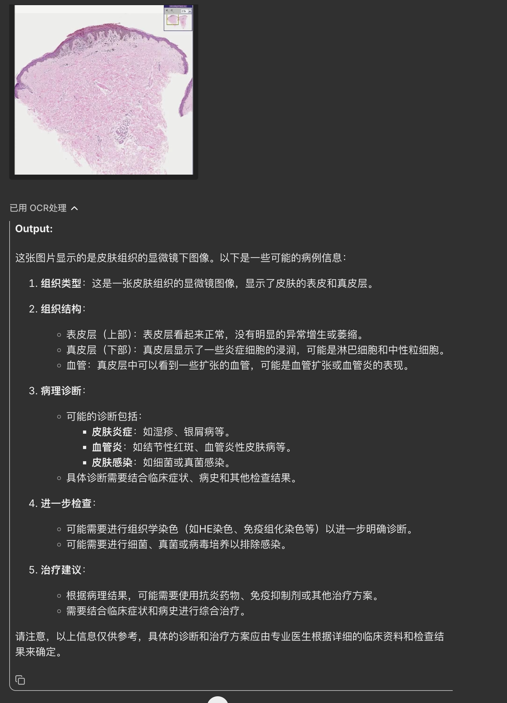

# Qwen2-VL-inference

This repository is a `MLLM inference server` which is used for [qwen2-vl series model](https://huggingface.co/Qwen/Qwen2-VL-7B-Instruct) using HuggingFace. 


**If you find this project helpful, please give it a ⭐, and for any questions or issues, feel free to create an issue.**

## Features

- Support OpenAI client
- stream response & normal response


## Update

- [2024/10/26] Open the source code.

## Installation

Install the reqired packages using `environment.yaml`

## Using the `environment.yaml`

```shell
conda env create -f environment.yaml
conda activate qwen2_vl
```

## How to start server

- run the server
```shell
MODEL=Qwen/Qwen2-VL-7B-Instruct API_PORT=10102 API_HOST=0.0.0.0 python app.py 
```


## Use Case

<div>
    </img>
</div>

## How to start client

```python
from openai import OpenAI

client = OpenAI(
    base_url='http://127.0.0.1:10102/v1',
    # required but ignored
    api_key='your_key',
)

stream = client.chat.completions.create(
    messages=[
            {
                "role": "user",
                "content": [
                    {
                        "type": "image",
                        "image": "https://qianwen-res.oss-cn-beijing.aliyuncs.com/Qwen-VL/assets/demo.jpeg",
                    },
                    {"type": "text", "text": "请详细描述这张图片."},
                ],
            }
        ],
    model='qwen',
    temperature=0, 
    max_tokens=256,
    stream=True
)

full_response = ""
for chunk in stream:
    if chunk.choices[0].delta.content is not None:
        content = chunk.choices[0].delta.content
        full_response += content
        print(content)
```

## message formart

```python
## url
response = client.chat.completions.create(
    messages = [
        {
            "role": "user",
            "content": [
                {
                    "type": "image",
                    "image": "https://qianwen-res.oss-cn-beijing.aliyuncs.com/Qwen-VL/assets/demo.jpeg",
                },
                {"type": "text", "text": "请详细描述这张图片."},
            ],
        }
    ],
    model='qwen',
    max_tokens=512,
    stream=False
)

## base64
response = client.chat.completions.create(
    messages=[
        {
            "role": "user",
            "content": [
                {
                    "type": "image",
                    "image": f"data:image;base64,{base64_data}"
                },
                {"type": "text", "text": "请描述这张图片"},
            ],
        }
    ],
    model='qwen',
    max_tokens=512,
    stream=False
)

```

## License

This project is licensed under the Apache-2.0 License. 

## Citation

If you find this repository useful in your project, please consider giving a star 🌟 and citing:

```bibtex
@misc{Qwen2-VL-inference,
  author = {Cheng ZHANG},
  title = {Qwen2-VL-inference},
  year = {2024},
  publisher = {GitHub},
  url = {https://github.com/ZachcZhang/Qwen2-VL-inference}
}
```

## Acknowledgement

This project is based on

- [LLaMA-Factory](https://github.com/hiyouga/LLaMA-Factory)
- [Qwen/Qwen2-VL-7B-Instruct](https://huggingface.co/Qwen/Qwen2-VL-7B-Instruct)